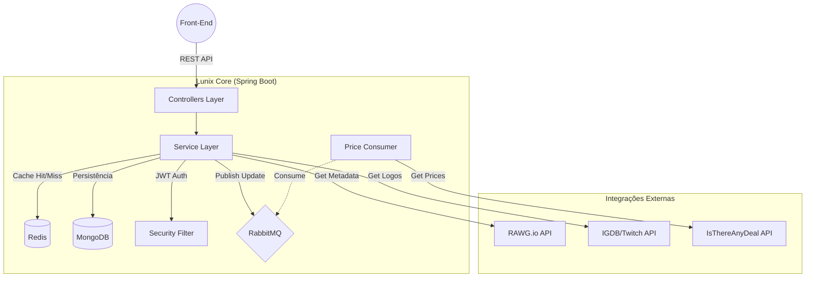

<div align="center">
  
# 🎮 Lunix - O Motor para Divulgação de Jogos Indie

**O Core para o projeto da IndieZone**

</div>

<p align="center">
  
  
  
  
  
  
  
</p>

---

## 🔗 Links Úteis

<div align="center">

| Tipo | Acesso |
| :--- | :--- |
| **🗃️ Documentação da API do RAWG** | [](https://rawg.io/apidocs) |
| **🗃️ Documentação da API do ITAD** | [](https://docs.isthereanydeal.com/) |
| **🗃️ Documentação da API da IGDB** | [](https://api-docs.igdb.com/#getting-started) |
| **🌿 Download MongoDB** | [](https://www.mongodb.com/try/download/community?msockid=0ef71af9117e671021920ecd10076665) |

</div>

---

## 🎯 Sobre o Projeto

O **Lunix** é a API RESTful robusta que alimenta a plataforma **IndieZone**, um ecossistema dedicado à promoção e descoberta de jogos independentes.

Diferente de catálogos estáticos, o Lunix atua como um hub inteligente que **agrega dados de múltiplas fontes globais** (RAWG, IsThereAnyDeal, IGDB), mantém preços atualizados em tempo real e gerencia uma comunidade de avaliações com regras de negócio estritas para garantir transparência.

### Diferenciais Técnicos
* **Integração Multi-API:** Sincroniza metadados ricos (screenshots, trailers, devs) e preços de lojas globais de forma transparente.
* **Performance com Cache:** Utiliza **Redis** para cachear endpoints críticos (como Top 10 e Detalhes de Jogos) e Blacklist de Tokens JWT.
* **Atualização Assíncrona de Preços:** Sistema inteligente via **RabbitMQ** que agenda e processa atualizações de preços massivas sem travar a experiência do usuário.
* **Segurança Granular:** Controle de acesso baseado em Roles (`ADMIN`, `DEV`, `USER`) com proteção contra conflitos de interesse (Devs não podem avaliar seus próprios jogos).

---

## ✨ Funcionalidades Principais

### 🕹️ Gestão de Jogos e Catálogo
* **Importação Inteligente:** Ao cadastrar um jogo, o sistema busca automaticamente dados na **RAWG API** e Logos na **IGDB API** para preencher o formulário.
* **Vitrine Dinâmica:** Listagens otimizadas com filtros por Gênero, Plataforma, Desenvolvedor e Empresa.
* **Sincronização de Preços:** Monitoramento de ofertas em lojas digitais (Steam, GOG, Epic, etc.) via **IsThereAnyDeal API**.

### ⭐ Sistema de Avaliações e Comunidade
* **Reviews Seguras:** Usuários podem dar notas e comentar.
* **Proteção Anti-Fraude:** Bloqueio de auto-avaliação para Desenvolvedores e membros de Empresas cadastradas.
* **Cálculo de Média Agregada:** Otimizado com **MongoDB Aggregation Framework** para performance em larga escala.

### 📊 Dashboard Administrativo (API)
Endpoints analíticos exclusivos para administradores:
* **Métricas em Tempo Real:** Total de jogos, usuários ativos/inativos, distribuição por gênero.
* **Gestão de Usuários:** Soft-delete, promoção de cargos e auditoria.

---

## 🛠️ Tech Stack

* **Linguagem:** Java 21
* **Framework:** Spring Boot 3.5.6
  * *Web:* Spring MVC (REST)
  * *Data:* Spring Data MongoDB
  * *Security:* Spring Security + JWT
  * *Cache:* Spring Data Redis
  * *Messaging:* Spring AMQP (RabbitMQ)
* **Banco de Dados:** MongoDB
* **Cache/Sessão:** Redis
* **Mensageria:** RabbitMQ
* **Documentação:** Swagger UI (OpenAPI 3)
* **Migrations:** Mongock
* **Deploy:** Docker + Render

---

## 🏗️ Arquitetura e Fluxo de Dados

O projeto utiliza uma arquitetura de microsserviços lógicos, separando responsabilidades de negócio, integração externa e mensageria.



---

## 🚀 Como executar localmente

1. **Pré-requisitos**
   * **Java 21** (JDK) instalado
   * **Maven** instalado
   * **MongoDB** rodando localmente
   * **Redis** rodando localmente
   * **RabbitMQ** rodando localmente
  
2. **Configuração das Variáveis de Ambiente**
   Crie as variáveis de ambiente no seu sistema ou IDE com as chaves de api externas

  | Variável | Descrição |
  | :--- | :--- |
  | **MONGO_URL** | URL de endereço do mongoDB |
  | **RAWG_API_KEY** | Chave de API da RAWG |
  | **ITAD_API_KEY** | Chave de API da ITAD |
  | **TWITCH_CLIENT_ID** | Id de cliente da sua conta twitch |
  | **TWITCH_CLIENT_SECRET** | Secret gerado pela IGDB |
  | **JWT_SECRET** | Secret para gerar os Tokens JWT |
  | **REDIS_HOST** | Host do Redis |
  | **REDIS_PORT** | Porta para o Redis |
  | **REDIS_PASSWORD** | Senha para o Redis |
  | **REDIS_USERNAME** | Nome de usuário do redis |
  | **RABBIT_ADD** | Endereço para o RabbitMQ (Caso use o plano free do CloudAMQP) |

3. **Executando a Aplicação**
   
   ```bash
      mvn spring-boot:run
   ```

   A api subirá em: `http://localhost/8081/lunix`

4. **Documentação (Swagger)**
   Após iniciar, acesse a documentação interativa para testar os endpoints:

   * **Swagger UI:** `http://localhost:8081/lunix/swagger-ui/index.html`

---

## 🧪 Estrutura de Testes

O projeto possui uma suíte robusta de testes unitários e de integração utilizando **JUnit 5** e **Mockito**.

* **Testes de Mapper**: Garantem que os DTOs estão sendo convertidos corretamente para Entidades e vice-versa.
* **Testes de Service**: Validam regras de negócio (ex: impedir auto-avaliação, unicidade de e-mail).
* **Testes de Integração (Live)**: Existem testes marcados como `@Disabled` (Smoke Tests) que podem ser ativados manualmente para verificar a conectividade real com as APIs externas.

Para rodar os testes:

  ```bash
    mvn test
  ```

---

## 🤝 Contribuição
Este é um projeto de código aberto focado no aprendizado e evolução da comunidade.

1. Faça um **Fork** do projeto.
2. Crie uma **Branch** para sua feature (`git checkout -b feature/NovaFeature`).
3. Faça o **Commit** (`git commit -m 'Adicionando nova feature'`).
4. Faça o **Push** (`git push origin feature/NovaFeature`).
5. Abra um **Pull Request**.

---

<div align="center">
  
**IndieZone Project - 2025**

Desenvolvido com Java 21, Spring Boot e paixão por jogos independentes 👾

</div>
